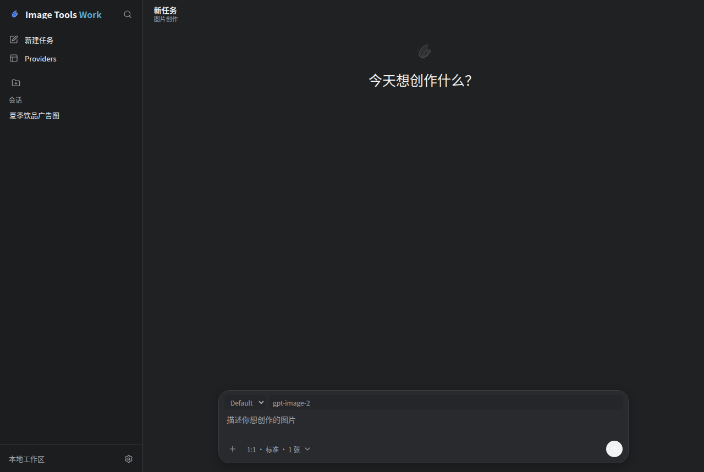

# Image Tools

[](https://github.com/MakeLuvHell/imagetools/actions/workflows/ci.yml)
[](LICENSE)

Windows 桌面图片创作工作台，内置 OpenAI Compatible、xAI Imagine 和 Gemini Native Image 协议，用于文生图、多参考图生成、会话化历史管理和本地结果追溯。

[下载最新公开版本](https://github.com/MakeLuvHell/imagetools/releases/latest) · [使用文档](docs/user-guide.md) · [参与贡献](CONTRIBUTING.md)



## 当前能力

- 单一 Tauri/Rust 应用进程；正式版的应用负载只有 `Image Tools.exe`。
- 前端资源随应用打包，通过 Tauri IPC 调用 Rust 后端，不启动本地 Web/API 服务，也不监听 UI 端口。
- Rust 使用 `rusqlite` 管理本地历史，使用 `reqwest` 调用图片 Provider。
- Codex Desktop Windows 风格的克制侧栏、无框任务流和底部双层 Composer，支持系统、浅色和深色主题。
- 多 Provider 配置，可检测联通性、获取可用模型，并按协议约束模型和生成参数。
- 会话、项目、固定会话、生成轮次、最多三张有序参考图和结果图管理。
- 图片元数据保存在 SQLite，文件保存在工作区数据目录；设置可安排重启后切换目录。
- 结果图通过只接受数据库图片 ID 的只读媒体协议展示，并可用系统原生保存对话框导出。

不包含云同步、账号、多用户、素材中心、系统凭据存储、自动更新或内置图片编辑器。

## 下载与安装

前往 [GitHub Releases](https://github.com/MakeLuvHell/imagetools/releases/latest) 下载 Windows x64 版本：

- MSI 适合正常安装和从开始菜单启动。
- Portable ZIP 解压后直接运行，包内只有 `Image Tools.exe`。

程序依赖 Microsoft Edge WebView2 Runtime。发布资产尚未签名，首次运行可能显示 SmartScreen 提示。下载后可使用 Release 附带的 `SHA256SUMS` 校验文件完整性。详细步骤和数据备份要求见 [使用文档](docs/user-guide.md)。

## 安装开发依赖

推荐使用 `mise` 安装项目工具链和依赖：

```bash
mise install
mise run install
```

项目 `.mise.toml` 固定了 Node.js 24.16.0、Rust 1.96.1 和 Python 3.12.13。Python 只用于测试和 Linux 工具包装脚本，不进入应用运行时或 Windows 发布资产。

还需要安装当前平台的 Tauri 系统依赖。Ubuntu 24.04 可参考 Tauri v2 的 Linux 依赖安装：

```bash
sudo apt install -y \
  build-essential \
  curl \
  file \
  libayatana-appindicator3-dev \
  librsvg2-dev \
  libssl-dev \
  libwebkit2gtk-4.1-dev \
  libxdo-dev \
  pkg-config \
  wget
```

检查 Linux 桌面系统依赖：

```bash
mise run desktop-prereqs
```

如果当前环境没有 sudo 或不能安装系统包，可以让项目下载本地 sysroot：

```bash
mise run desktop-sysroot
```

`desktop-check`、`desktop-dev` 和 `desktop-build` 会优先使用系统依赖；缺失时使用 `build/tauri-sysroot/`。

## 运行桌面开发版

```bash
mise run desktop-dev
```

该命令直接启动 Tauri 窗口并加载仓库内的 `frontend/`。修改 HTML、CSS 或 JavaScript 后刷新窗口；Rust 代码由 Tauri watcher 重新构建。开发版和正式版使用同一套 Tauri IPC、Rust 数据服务和应用内资源路径。

## 构建发布版

本地平台构建：

```bash
mise run desktop-build
```

Windows x64 MSI：

```bash
npm run desktop:build:windows
```

MSI 位于：

```text
src-tauri/target/x86_64-pc-windows-msvc/release/bundle/msi/
```

GitHub Actions 的 Windows runner 会同时发布：

```text
Image-Tools-v0.4.0-Windows-x64.msi
Image-Tools-v0.4.0-Windows-x64-Portable.zip
```

Portable ZIP 中只有 `Image Tools.exe`。工作流会检查 MSI 与 Portable 的负载、安装/卸载、单进程行为、关闭退出和无监听端口，并用公开的 v0.3.0 MSI 验证 schema-v2 到 schema-v3 的升级。回滚到 v0.3.0 时必须恢复升级前的 schema-v2 工作区备份，不能直接打开已迁移的 schema-v3 数据库。手动运行默认只验证并保留 workflow artifact；只有显式设置 `publish_release=true` 才会公开 Release 资产。发布流程见 [`docs/releases/github-release.md`](docs/releases/github-release.md)。

## 运行时数据

Windows 默认工作区数据目录由 Tauri 的 `app_data_dir` 提供，当前标识为 `com.imagetools.desktop`，通常对应 `%APPDATA%\com.imagetools.desktop\`。目录选择配置由 `app_local_data_dir` 提供，通常位于 `%LOCALAPPDATA%\com.imagetools.desktop\storage-location.json`。

在左下角设置中可输入新的绝对路径，或用系统目录选择器选取目录。提交后重启应用才会切换；可选择复制现有数据。复制保留旧目录作为恢复副本，不移动或删除源数据。迁移目标必须为空，自定义目录不可读写时应用会明确启动失败。

工作区数据布局：

- `workbench.sqlite3`：Provider、项目、会话、生成轮次和图片元数据。
- `images/`：生成结果文件。
- `uploads/`：暂存参考图；一次性 token 使用后清理，过期文件也会回收。
- `settings.json`：兼容旧版单 Provider 设置；首次初始化会导入默认 Provider。

`storage-location.json` 位于固定配置目录，不随工作区迁移。主题选择以应用稳定 origin 下的 `localStorage` 为主；当前仍保留 Tauri cookie 镜像作为兼容层，二者都不属于工作区数据。

## 验证

仓库检查：

```bash
mise run test
mise run ui-test
mise run desktop-check
python scripts/run_tauri_linux_env.py cargo test --manifest-path src-tauri/Cargo.toml
```

Windows 发布门禁必须在 Windows x64 runner 上针对真实 MSI 和 Portable ZIP 运行：

```powershell
pwsh -NoProfile -File scripts/verify_windows_single_process.ps1 `
  -Msi release-assets/Image-Tools-v0.4.0-Windows-x64.msi `
  -PortableZip release-assets/Image-Tools-v0.4.0-Windows-x64-Portable.zip
```

Linux Chromium 和 WebKitGTK 可验证前端布局、行为与桌面编译，但不能替代 Windows WebView2、安装器和进程生命周期门禁。

## 图片接口说明

Provider 必须显式选择协议，不根据名称、模型或域名猜测：

- OpenAI Compatible：`/v1/images/generations` 与 `/v1/images/edits`。
- xAI Imagine：Bearer JSON 请求到 `/v1/images/generations` 或 `/v1/images/edits`，支持最多三张有序参考图。
- Gemini Native Image：`x-goog-api-key` 请求到 `/v1beta/models/{model}:generateContent`，支持最多三张有序 `inlineData` 参考图，每次返回一张图片。

设置中的“检测联通性”和“获取可用模型”相互独立；模型发现结果缓存在本地 Provider 记录中，失败不会清除上一次成功缓存。完整 OpenAI 字段适配见 [`docs/api/gpt-image-api-frontend-adapter.md`](docs/api/gpt-image-api-frontend-adapter.md)。

## 开源项目

- [贡献指南](CONTRIBUTING.md)
- [安全策略](SECURITY.md)
- [社区行为准则](CODE_OF_CONDUCT.md)
- [项目路线图](docs/roadmap.md)
- [MIT License](LICENSE)

普通缺陷和功能建议请使用仓库的 Issue 模板。安全漏洞或可能泄露 API Key、私人提示词及图片的问题，请按照 [安全策略](SECURITY.md) 私下报告。
